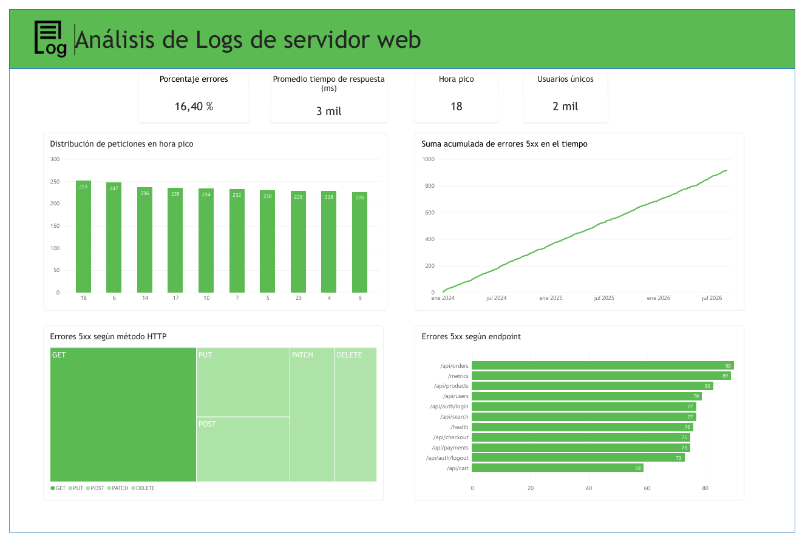

# Análisis de Logs de Servidor Web

Diagnóstico de calidad de datos, disponibilidad y performance de un servidor web mediante SQL (DuckDB) sobre un dataset de logs con problemas reales de calidad de datos: timestamps en 5 formatos distintos, ~24% de status codes faltantes, ~24% de endpoints sin identificar y outliers extremos de latencia. Antes de sacar conclusiones de negocio, el proyecto construye una capa de staging que detecta, cuantifica y documenta cada uno de estos problemas.



## Hallazgos clave (post-limpieza, N = 5,587 requests)

| Métrica | Valor |
|---|---|
| Tasa de errores 5xx | **16.4%** (916 de 5,587 requests) |
| Endpoints con error rate >20% | **5 de 12** |
| Usuarios únicos | **2,451** |
| Hora pico de tráfico (excluyendo hora 0, ver nota de calidad de datos) | **18:00** (251 requests) |
| Período cubierto | 2024-01-01 a 2026-08-22 |

### Endpoints críticos identificados
- `/api/orders` — 23.02% error rate, 90 errores 5xx
- `/metrics` — 21.87% error rate, 89 errores 5xx
- `/api/users` — 21.64% error rate, 79 errores 5xx

Estos tres endpoints concentran una porción desproporcionada de los errores 5xx y son los primeros candidatos a investigar.

## Calidad de datos: lo que hace distinto a este análisis

A diferencia de un análisis sobre datos ya curados, este dataset venía con corrupción real que hubo que detectar y decidir cómo tratar:

- **103 timestamps (1.81%)** correspondían a fechas futuras imposibles (posteriores a hoy) → se excluyeron explícitamente, documentando el criterio.
- **1,324 requests (23.7%)** no tenían un endpoint identificable → se agruparon como `unknown_endpoint` en vez de descartarse silenciosamente.
- **1,321 requests (23.65%)** no tenían `status_code` válido.
- **Distribución de latencia bimodal**: el p95 se mantiene por debajo de 500ms en todos los endpoints, pero el máximo supera los 300,000ms en varios de ellos. Un puñado de outliers extremos distorsiona el promedio y el p99 — por eso el análisis reporta percentiles y no solo promedios.
- **5 formatos de fecha distintos** en el campo `timestamp` (ISO, `%m/%d/%Y`, `%d %b %Y`, `%Y/%m/%d`, `%d-%m-%Y`, `%b %d, %Y`) requirieron una vista de staging con parseo en cascada (`TRY_STRPTIME`).
- Los formatos solo-fecha no traen hora, por lo que el casteo les asigna 00:00:00 por defecto — esto infla artificialmente el bucket "hora 0" en cualquier análisis de tendencia horaria, y se excluye explícitamente de esos análisis.

## Stack tecnológico

**Python 3.13** · **DuckDB** · **Jupyter Notebooks** · **Power BI**

## Estructura del proyecto

```
├── data/               # Datos fuente (JSON) - ignorado por git
├── notebooks/          # Análisis exploratorio y staging
├── results/            # Exports para dashboard y hallazgos
│   └── dashboard/       # Imagen/PDF del dashboard
└── README.md
```

## Documentación

- [Plan de Acción Detallado](plan_de_accion.md) — diagnóstico completo, hallazgos por sección y próximos pasos.

**Autor:** Agustín Rebechi
**Licencia:** MIT
